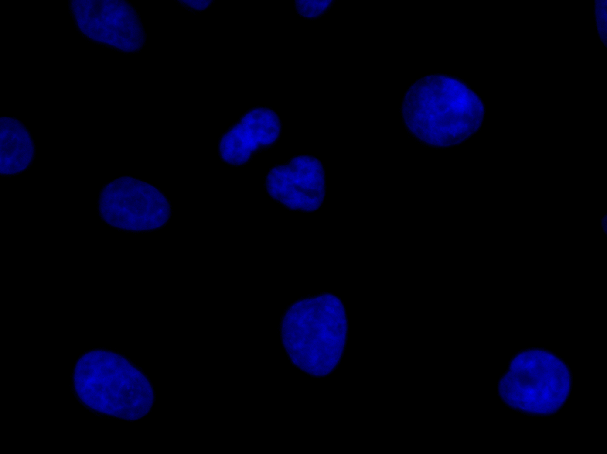
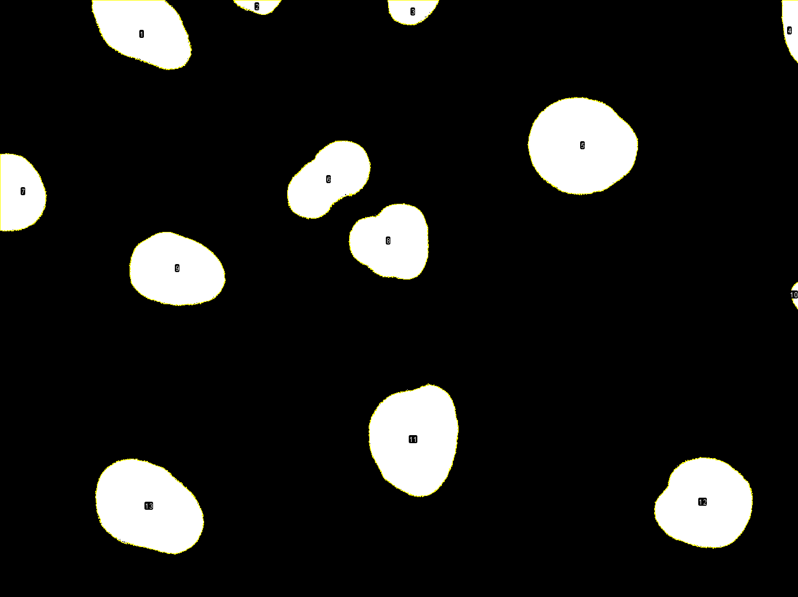

# bioimage-analysis-training-standards

Community work started during the Global BioImaging and NEUBIAS workshop:

"Developing community standards for bioimage analysis training"
7-9 November 2022, EMBL Heidelberg, Germany

https://globalbioimaging.org/international-training-courses/bioimage-analysis-standards-workshop

### Example image data

- Work in progress in [this table](https://docs.google.com/spreadsheets/d/1l8sX18I04P0sl2iTs6SRK90lYhkJWHy91QjIvjEip3k/edit?usp=sharing).

### Digital image

### Image measurements

### Segmentation

 | 
   ------ | ------|
  Original nuclei | Labelled nuclei |

Cell nuclei segmentation:

- Example image (visualize on Cell Image Library): http://www.cellimagelibrary.org/images/41066

- Example image (download from Cell Image Library): https://cildata.crbs.ucsd.edu/media/images/41066/41066.tif
